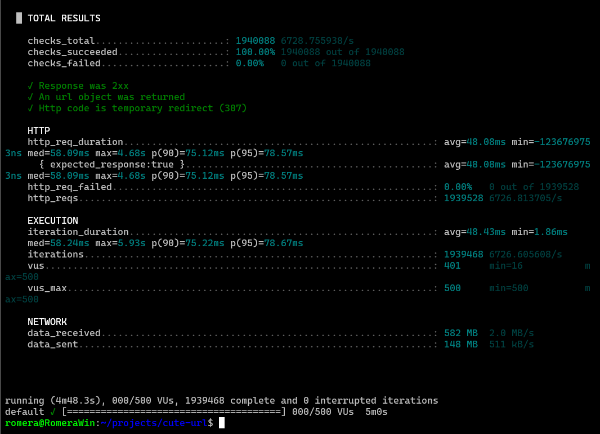
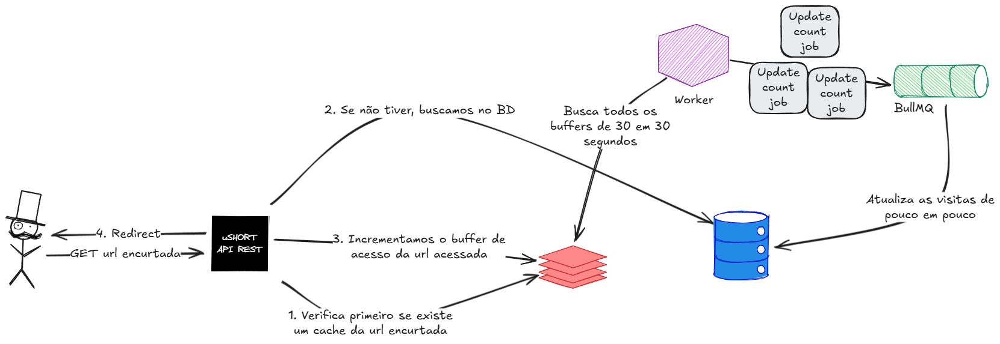

# Sobre
A aplicação deve possibilitar o cadastro de usuários e a encurtação de urls (seja com um usuário autenticado ou não)

No aspecto da <a href="#escalabilidade">escalabilidade</a> comentada abaixo, fiz um vídeo demonstrando o comportamento da contabilização e tentando explicar a minha linha de raciocínio

[Acesse o vídeo aqui](https://youtu.be/Es148LyWN6s)

### Comportamentos da aplicação

- **Qualquer um** pode criar uma url encurtada, mesmo não estando autenticado, porém somente um usuário cadastrado pode editar, deletar, ou listar todas as suas urls já criadas

- Na rota de criação de url, se somente a url longa for provida, uma hash de 6 caracteres será gerada automaticamente. Porém, é possível passar um apelido manualmente para a rota em questão, com limite de até 50 caracteres.

# Diferenciais

### Escalabilidade

- A aplicação possui um sistema de filas, task scheduling e cache para lidar com muitos acessos simultâneos, enquanto lida com a contagem de visitas na url e mantêm um tempo de retorno médio menor do que 50ms.

- Foi feito um teste de estresse utilizando a ferramenta [k6](https://k6.io/) e obtive os seguintes resultados:
  - 500 usuários virtuais
  - Quase 2 milhões de acessos em menos de 5 minutos
  - 6726 req/s
  - Tempo médio de resposta de 48ms

- Resultados do k6:
<p align="center">
    
</p>

### Outros

- Lefthook para executar hooks pre commit e pre push
- BiomeJs para fazer o lint e a formatação do projeto
- Dockerfile e docker compose para subir o projeto com o ambiente já configurado
- Testes de carga e e2e
- Documentação dos endpoints com o Swagger (Acesse em http://localhost:3000/api/dev)
- Validação de todos os endpoints com a ajuda do class-validator

# Como Executar

### Docker

```sh
# Clonando o repositório
git clone git@github.com:RO03M/ushort-nestjs.git

# Acessando a pasta do projeto
cd ushort-nestjs

# Criação do .env base
cp .env.example .env

# Criando os containers (api, redis e postgres)
docker compose up -d api

# Comando para criar as tabelas no banco de dados
docker compose exec -it api yarn migrate
```

**Após fazer o projeto rodar, você pode acessar o swagger na rota /api/dev (http://localhost:3000/api/dev)**

### Rodar local sem docker

O projeto foi feito com o Node v24.4.1 e o yarn. Recomendo utilizar o nvm para facilitar a troca de versão

```sh
# Clonando o repositório
git clone git@github.com:RO03M/ushort-nestjs.git

# Acessando a pasta do projeto
cd ushort-nestjs

# Subindo postgres e redis
docker compose up -d redis db

# Criação do .env base
cp .env.example .env

# Usando a versão correta do node com nvm (Se não for utilizar o nvm pule essa etapa)
nvm install && nvm use

# Instalando o yarn
npm install -g yarn

# Criando node_modules
yarn ci

# Rodando migrations
yarn migrate

# Iniciando no modo dev
yarn dev
```

### Rodando testes

#### E2E

Testes feitos:
- Registrar usuário e logar
- Criar url e conseguir acessar a mesma

Para rodar eles, é só colar o seguinte comando:

```sh
yarn test:e2e
```

#### Carga

Para fazer o teste de carga utilizei o k6 do Grafana, infelizmente para rodar esse é preciso baixar o binário https://grafana.com/docs/k6/latest/set-up/install-k6/

Com ele baixado **e o projeto rodando na porta 3000**, é só rodar o seguinte comando:

```sh
k6 run test/stress/shorten-url-redirect.spec.ts
```

Esse teste de carga cria algumas urls no começo e depois sai acessando as mesmas, testando a capacidade de a aplicação suportar alta demanda sem se sobrecarregar

Se os testes falharem e o erro for "Request Failed", certifique-se que a aplicação está rodando corretamente

# Design da aplicação

<p align="center">
    
</p>

# Tecnologias Utilizadas

- Node 24.4.1
- NestJs
- Typescript
- Docker
- Postgres
- MikroORM
- Redis 8
- BullMQ

# Melhorias

- Adição de usuário de administrador para gerenciar informações da aplicação e gerenciar urls
- Rotas de analytics, para ver rotas mais acessadas, etc
- Log de acessos para conseguirmos ver em gráficos informações do tráfego de uma rota
- Cache mais inteligente das rotas, em sistemas com milhões de rotas devemos dar mais atenção para as rotas com maiores tráfego, aumentando o tempo de vida do cache entre outras coisas...
- Workers dedicados para fazer a contabilização de acessos e logs
